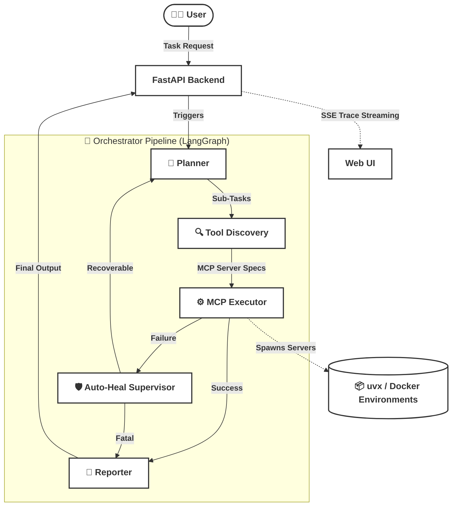

# 🚀 Auto-MCP

> **Plan → Execute → Auto-Heal**: An agentic AI system that dynamically discovers, installs, and runs Model Context Protocol (MCP) servers to fulfill complex natural language tasks. If an execution fails, a supervisor agent intercepts the error and orchestrates an autonomous recovery.

[](https://www.python.org/)
[](https://fastapi.tiangolo.com/)
[](https://modelcontextprotocol.io/)
[](https://ai.google.dev/)

---

## ✨ Features

| Feature                           | Description                                                                                                                               |
| --------------------------------- | ----------------------------------------------------------------------------------------------------------------------------------------- |
| 🧠**LLM Planner**           | Gemini decomposes complex natural-language queries into multi-step execution plans.                                                       |
| 🔌**Dynamic MCP Discovery** | Automatically searches GitHub or uses known servers to find the right MCP tool for the job.                                               |
| 🚀**Ephemeral Execution**   | Spins up MCP servers on-the-fly using`uvx` (or Docker), avoiding bloated local environments.                                            |
| 🛡️**Auto-Healing Loop**   | A LangGraph supervisor monitors execution. If a tool fails (e.g. missing table, bad args), the planner dynamically drafts recovery steps. |
| 📡**SSE Streaming**         | Real-time progress is streamed directly to the frontend UI as the agent thinks and acts.                                                  |
| 💾**Tool Caching**          | Successfully discovered tools are cached, speeding up subsequent steps in the pipeline.                                                   |

---

## 🏗️ Architecture



---

## 📁 Project Structure

```
auto_mcp/
├── config.py               # Centralized path, LLM, and MCP server configuration
├── demo_live.html          # Lightweight frontend UI for monitoring SSE execution traces
├── docker_manager.py       # (Optional) Fallback for running MCPs in isolated containers
├── graph.py                # LangGraph state machine (Planner, Discovery, Executor, Supervisor)
├── mcp_client.py           # Core logic for establishing Stdio MCP connections and routing calls
├── server.py               # FastAPI app — /execute/{scenario_id}, /scenarios
├── test_scenario.py        # Curated execution scenarios for the orchestrator
├── artifacts/              # Directory where execution logs and generated output files are stored
├── requirements.txt        # Python dependencies
├── .env.example            # Environment variable template
└── README.md
```

---

## 🚀 Quick Start

### Prerequisites

- Python 3.10+
- [uv](https://github.com/astral-sh/uv) (for running dynamic MCP servers via `uvx`)
- A [Google AI Studio](https://aistudio.google.com/) API key

### 1. Clone & configure

```bash
git clone https://github.com/<your-org>/auto-mcp.git
cd auto-mcp
cp .env.example .env
# Edit .env and paste your GOOGLE_API_KEY
```

### 2. Create Python environment & install dependencies

This project expects a local `.venv` environment to be created to ensure isolated execution of dynamically fetched `uvx` packages (as configured in `config.py`).

```bash
python -m venv .venv
# Windows:
.venv\Scripts\activate
# macOS/Linux:
source .venv/bin/activate

pip install -r requirements.txt
```

> [!NOTE]
> Ensure you have `uv` installed in this virtual environment (`pip install uv`) or globally on your system, as the orchestrator uses `uvx` to launch MCP servers on the fly.

### 3. Start the backend API

```bash
uvicorn server:app --reload --port 8080
# Starts on http://localhost:8080
```

### 4. Open the UI

Simply open `demo_live.html` in your web browser of choice. It will automatically connect to the FastAPI backend running on port 8080.

---

## 🔑 Environment Variables

Copy `.env.example` to `.env` and fill in your values:

```env
GOOGLE_API_KEY=your_google_api_key_here
# Optional: Change the Gemini model used by the orchestrator
LLM_MODEL=gemini-3.1-flash-lite
```

---

## ⚙️ Configuration

All paths, model settings, and GitHub API hints are centralized in [`config.py`](config.py). You can tweak the number of recovery retries, add blacklisted servers, or inject well-known MCP servers directly here:

```python
# Maximum number of planner-based recovery retries per step
MAX_RECOVERY_RETRIES = 1

# Well-Known Servers to prefer without needing a GitHub search
WELL_KNOWN_SERVERS = [
    {
        "name": "sqlite-mcp",
        "description": "Official MCP server for SQLite databases...",
        ...
    }
]
```

---

## 📄 License

MIT License — see [LICENSE](LICENSE) for details.
